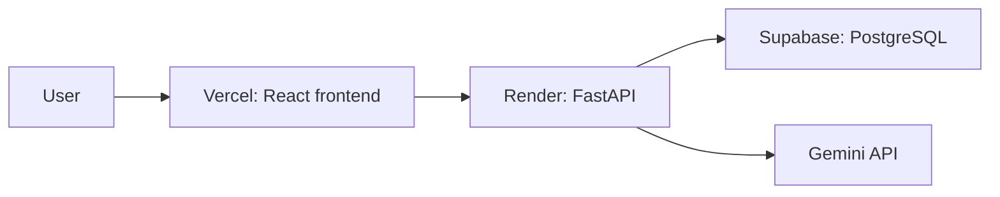

# ResumeLens

**Job-specific resume ATS analyzer with AI-powered recommendations and resume tailoring.**

ResumeLens compares a resume with a specific job description, explains the match, identifies supported and missing evidence, and can help tailor the resume without inventing candidate facts.

> The Job Match Score is an internal, explainable estimate based on the supplied job description. It does not reproduce any proprietary ATS algorithm.

## Project status

The landing page, PDF/DOCX upload, deterministic analysis API, weighted Job Match Score, database persistence, and results view are implemented in the current working tree. This analysis flow still needs to be committed and deployed, then verified against the production database. Gemini recommendations, semantic embeddings, resume tailoring, PDF export, and authentication are not implemented yet.

## Current features

- PDF and DOCX upload with extension, MIME, signature/package, and size checks
- Text extraction in memory; the uploaded file and extracted resume text are not stored
- Deterministic skill matching with required, preferred, partial, matched, and missing labels
- Explainable seven-factor Job Match Score and weighted breakdown
- Basic resume-section and text-readability heuristics
- Evidence-based recommendations that do not tell users to claim unsupported skills
- PostgreSQL persistence for job descriptions, resume metadata, scores, metrics, and recommendations

## Planned features

- Broader deterministic job-description extraction and skill vocabulary
- Semantic matching with embeddings
- Gemini-based explanations and truthful resume tailoring
- ATS-friendly PDF export
- User accounts and analysis history

## Technology

- Frontend: React, TypeScript, Vite, and Tailwind CSS
- Backend: Python, FastAPI, Pydantic, SQLAlchemy, and Alembic
- Database: PostgreSQL locally and Supabase PostgreSQL in production
- AI: Gemini API behind a provider interface
- Hosting: Vercel for the frontend and Render for the API

## Architecture



Local development will use the same application architecture with Vite, FastAPI, and PostgreSQL running on the developer's machine.

## Scoring approach

The score is calculated from seven deterministic factors: keyword/skill match (25%), required requirements (20%), experience evidence (15%), resume structure (10%), education match (10%), job-language overlap (10%), and ATS-style readability (10%). The current job-language factor compares repeated words; it is not semantic embedding similarity. See [the scoring guide](docs/scoring.md) for definitions and limitations. The score is not generated by asking an LLM for a number and does not reproduce any proprietary ATS algorithm.

## AI and factual accuracy

The resume is the source of truth. AI-assisted recommendations and tailoring must not invent skills, employers, dates, education, certifications, metrics, projects, or achievements. If the resume does not support a job requirement, the application should identify the gap rather than fabricate evidence.

## Local setup

Prerequisites: Python, Node.js/npm, Git, and a running local PostgreSQL service.
The backend and frontend use separate development servers.

### Backend and database

From PowerShell at the repository root:

```powershell
Set-Location .\backend
python -m venv .venv
.\.venv\Scripts\Activate.ps1
pip install -r requirements-dev.txt
python scripts\configure_local_database.py
python -m uvicorn app.main:app --reload --host 127.0.0.1 --port 8000
```

The database helper asks for the PostgreSQL port and the `resume_app` password;
password input is masked. It writes the connection URL into the ignored
repository-root `.env`. Do not commit or share that file.

In a second PowerShell window, from the repository root:

```powershell
Set-Location .\frontend
npm ci
npm run dev
```

The frontend is at `http://127.0.0.1:5173`, the backend is at
`http://127.0.0.1:8000`, and FastAPI's interactive documentation is at
`http://127.0.0.1:8000/docs`. Apply committed database migrations from the
`backend` directory with `python -m alembic -c alembic.ini upgrade head`.

Run backend unit and API tests from the `backend` directory with:

```powershell
python -m unittest discover -s tests -v
```

Run the frontend type check and production build from `frontend` with:

```powershell
npm run build
```

The root `.env.example` documents local settings. Put real credentials only in
the ignored `.env` file and never expose server secrets to the frontend.

## Privacy and security

Resumes contain sensitive personal information. Uploaded files and extracted resume text are processed temporarily and are not stored. The database does store the job description, file media type and SHA-256 digest, score factors, and recommendations. The current MVP has no accounts, so it should not be treated as private analysis history. API keys, database credentials, and signing secrets belong in server-side environment variables, never in frontend code.

## Deployment

The production setup links GitHub `main` to Vercel and Render for automatic deployment. The Render Blueprint runs `alembic upgrade head` during its build before starting the API. Production deployment of the current analysis flow is pending; verify the Render build log and Supabase Alembic revision after pushing. See [deployment notes](docs/deployment.md).

## License

This project is licensed under the MIT License. See [LICENSE](LICENSE).

