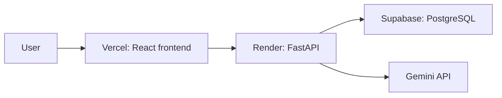

# ResumeLens

**Job-specific resume ATS analyzer with AI-powered recommendations and resume tailoring.**

ResumeLens compares a resume with a specific job description, explains the match, identifies supported and missing evidence, and can help tailor the resume without inventing candidate facts.

> The Job Match Score is an internal, explainable estimate based on the supplied job description. It does not reproduce any proprietary ATS algorithm.

## Project status

The local landing page, FastAPI status routes, PostgreSQL connection, and first Alembic migration are working. Resume upload and analysis, AI recommendations, tailoring, and public deployment are still in progress.

## Planned features

- Resume upload for PDF and DOCX files
- Job-specific skill and requirement matching
- Explainable Job Match Score with a weighted breakdown
- ATS-style structure and formatting checks
- Evidence-based recommendations and optional AI-assisted tailoring
- ATS-friendly PDF export

## Planned technology

- Frontend: React, TypeScript, Vite, and Tailwind CSS
- Backend: Python, FastAPI, Pydantic, SQLAlchemy, and Alembic
- Database: PostgreSQL locally and Supabase PostgreSQL in production
- AI: Gemini API behind a provider interface
- Hosting: Vercel for the frontend and Render for the API

## Architecture



Local development will use the same application architecture with Vite, FastAPI, and PostgreSQL running on the developer's machine.

## Scoring approach

The score will be calculated from configurable, explainable components such as skill match, required requirements, experience relevance, education match, semantic relevance, resume structure, and ATS-style formatting. Required skills will carry more weight than preferred skills. The score will not be generated by asking an LLM for a number.

## AI and factual accuracy

The resume is the source of truth. AI-assisted recommendations and tailoring must not invent skills, employers, dates, education, certifications, metrics, projects, or achievements. If the resume does not support a job requirement, the application should identify the gap rather than fabricate evidence.

## Local setup

Prerequisites: Python, Node.js/npm, Git, and a running local PostgreSQL service.
The backend and frontend use separate development servers.

### Backend and database

From PowerShell at the repository root:

```powershell
Set-Location .\backend
python -m venv .venv
.\.venv\Scripts\Activate.ps1
pip install -r requirements.txt
python scripts\configure_local_database.py
python -m uvicorn app.main:app --reload --host 127.0.0.1 --port 8000
```

The database helper asks for the PostgreSQL port and the `resume_app` password;
password input is masked. It writes the connection URL into the ignored
repository-root `.env`. Do not commit or share that file.

In a second PowerShell window, from the repository root:

```powershell
Set-Location .\frontend
npm ci
npm run dev
```

The frontend is at `http://127.0.0.1:5173`, the backend is at
`http://127.0.0.1:8000`, and FastAPI's interactive documentation is at
`http://127.0.0.1:8000/docs`. Apply committed database migrations from the
`backend` directory with `python -m alembic -c alembic.ini upgrade head`.

The root `.env.example` documents local settings. Put real credentials only in
the ignored `.env` file and never expose server secrets to the frontend.

## Privacy and security

Resumes contain sensitive personal information. The application is intended to process uploaded files temporarily, validate file types and sizes, avoid logging resume contents, and delete temporary files after processing where practical. API keys, database credentials, and signing secrets belong in server-side environment variables, never in frontend code.

## Deployment

The planned production flow connects the `main` branch on GitHub to Vercel and Render for automatic deployments. Deployment instructions and the live demo link will be added after the services are configured and verified.

## License

This project is licensed under the MIT License. See [LICENSE](LICENSE).

