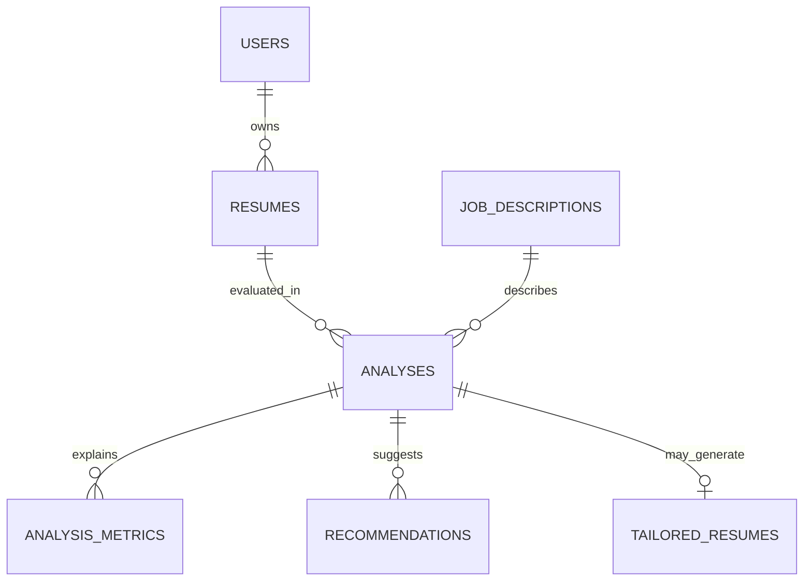

# Database Design

ResumeLens uses PostgreSQL with SQLAlchemy as its ORM. Alembic tracks schema
changes as versioned migration files so a fresh development or production
database can be brought to the same schema safely and repeatably.

## Local connection

The local development database is `resume_ats`. On the current workstation,
PostgreSQL listens on `127.0.0.1:1111`; other installations commonly use port
`5432`. The setup helper prompts for the application role's password without
displaying it, then writes `DATABASE_URL` to the ignored repository-root
`.env` file. Never commit that file or paste its contents into chat.

Production uses a Supabase PostgreSQL connection string supplied to the backend
as a Render environment variable. Application code reads `DATABASE_URL` in
either environment and does not embed credentials in source files.

## Tables



| Table | Purpose |
| --- | --- |
| `users` | Future account records. Authentication is not implemented yet; passwords must only be stored as secure hashes. |
| `resumes` | File type, content hash, optional owner, and expiry metadata. The uploaded file and extracted resume text are not stored in this table. |
| `job_descriptions` | The job title, company, and description supplied for an analysis. |
| `analyses` | Analysis status, overall score, scoring version, and links to the resume metadata and job description. |
| `analysis_metrics` | Per-factor score, weight, and compact structured explanation data. Weights are fractions from 0 to 1. |
| `recommendations` | Prioritized recommendations attached to an analysis. |
| `tailored_resumes` | Export status, format, content hash, and expiry metadata. The tailored resume content and PDF bytes are not stored here. |

IDs use UUIDs. Foreign keys connect related rows, and database constraints
reject out-of-range scores, invalid statuses, and duplicate metric keys within
one analysis. `POST /api/v1/analyze` creates the resume metadata, job
description, analysis, metrics, and recommendations in one transaction. The
uploaded file and extracted text are not written to these tables; only the
file's media type and SHA-256 digest are kept.

## Migration workflow

From the `backend` directory, after changing a SQLAlchemy model:

```powershell
.\.venv\Scripts\python.exe -m alembic -c alembic.ini revision --autogenerate -m "describe schema change"
```

Review the generated migration before applying it. Autogeneration is a draft
and can miss intent, such as data transformations.

Apply pending migrations locally:

```powershell
.\.venv\Scripts\python.exe -m alembic -c alembic.ini upgrade head
```

Check the applied revision:

```powershell
.\.venv\Scripts\python.exe -m alembic -c alembic.ini current
```

Migrations are committed alongside model changes. The Render Free service does
not support a pre-deploy command, so the current Blueprint runs
`alembic upgrade head` in its build command after installing dependencies.
Alembic applies unapplied revisions and is a no-op when the database is already
at the latest revision. The API itself does not create or alter tables at
startup.
